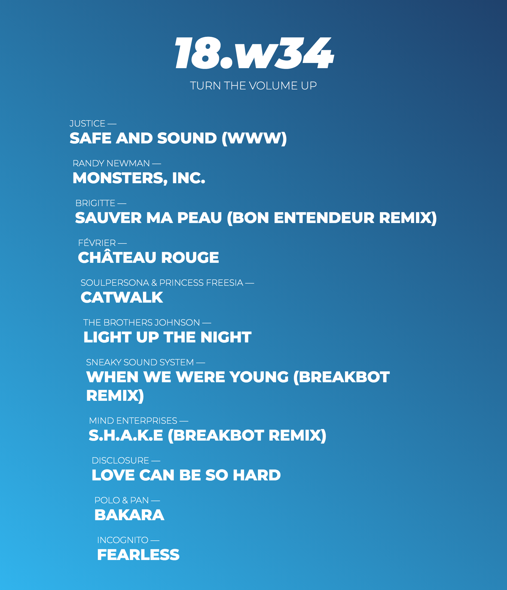

# music

This is the source code of the website I'm using to showcase my iTunes playlists.
See it live [here](http://yopox.llgames.fr/music).

## Features

- m3u playlist parser
- Automatic YouTube search when a song is clicked

## TODO

- Change init to accept any filename
